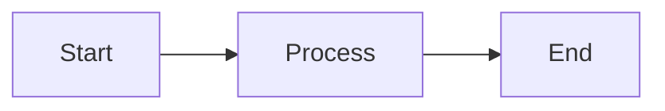

Write diagrams as `mermaid` fenced code blocks or with the `Mermaid`
component. Blocks render client-side; the raw definition stays in the markup
for search indexing and no-JS fallbacks.



````md

````

## Component usage

<Mermaid chart="flowchart LR
  A --> B" title="Minimal example" />

```tsx
<Mermaid chart="flowchart LR
  A --> B" title="Minimal example" />
```

The diagram definition can also go in children:

<Mermaid>
flowchart TD
  Top --> Bottom
</Mermaid>

```tsx
<Mermaid>
  flowchart TD
    Top --> Bottom
</Mermaid>
```

See the [Mermaid documentation](https://mermaid.js.org/intro/) for the full
syntax: flowcharts, sequence diagrams, Gantt charts, and more.

## Properties

<PropertiesTable>
<PropertiesTable.Row name="chart" type="string">
  Diagram definition. Defaults to the string children.
</PropertiesTable.Row>

<PropertiesTable.Row name="title" type="ReactNode">
  Optional caption above the diagram.
</PropertiesTable.Row>

<PropertiesTable.Row name="actions" type="boolean" default="true">
  Show zoom and reset controls.
</PropertiesTable.Row>

<PropertiesTable.Row name="placement" type="'top-left' | 'top-right' | 'bottom-left' | 'bottom-right'" default="'bottom-right'">
  Corner for the controls. Fences accept `placement="top-left"` in the info string.
</PropertiesTable.Row>

<PropertiesTable.Row name="children" type="ReactNode">
  Diagram definition when `chart` is omitted.
</PropertiesTable.Row>
</PropertiesTable>
